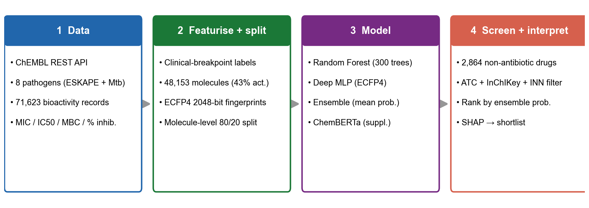
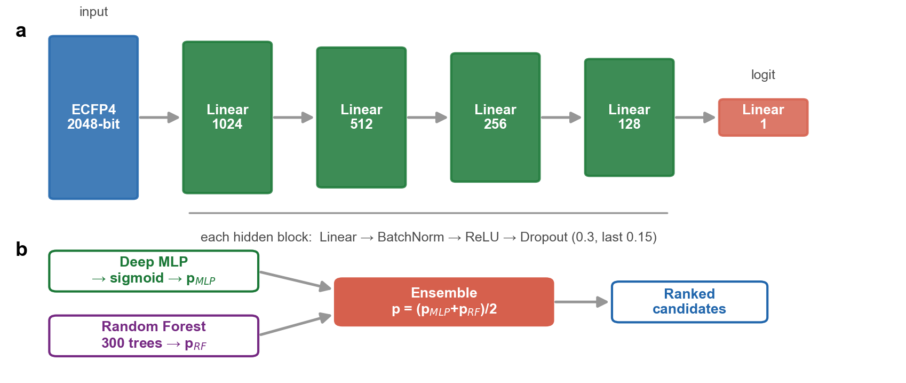
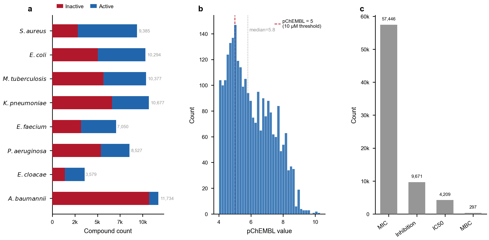
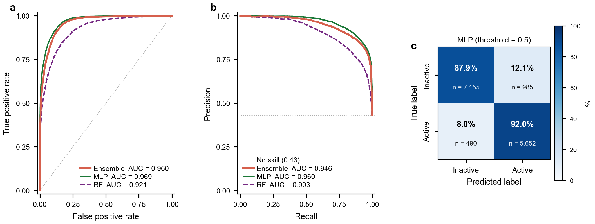
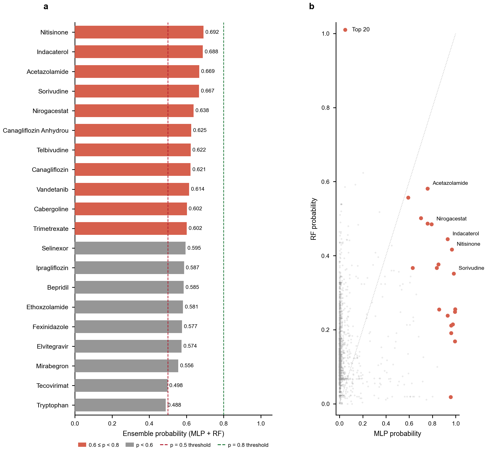
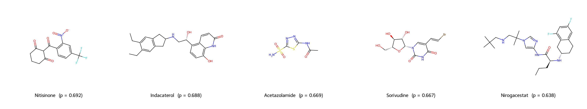
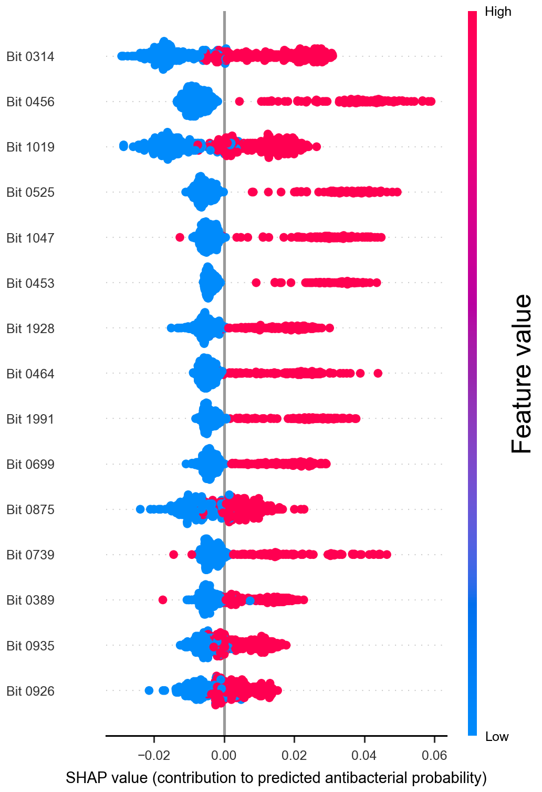

# Ensemble Machine Learning Framework for Computational Drug Repurposing Against ESKAPE Pathogens*

---

## Abstract

Antimicrobial resistance (AMR) poses an escalating threat to global public health, with bacterial infections claiming an estimated 1.27 million attributable deaths in 2019 alone. The ESKAPE pathogens—*Enterococcus faecium*, *Staphylococcus aureus*, *Klebsiella pneumoniae*, *Acinetobacter baumannii*, *Pseudomonas aeruginosa*, and *Enterobacter* species—together with *Mycobacterium tuberculosis*, account for a disproportionate share of drug-resistant infections worldwide. The high cost and long timelines of de novo antibiotic development make computational drug repurposing an attractive alternative, as FDA-approved compounds already possess established safety profiles. Here we present an ensemble machine learning framework that integrates a Random Forest (RF) and a deep multilayer perceptron (MLP) trained on 2048-bit Extended Connectivity Fingerprints (ECFP4) derived from 71,623 bioactivity records spanning eight pathogens, retrieved from the ChEMBL database. Using a strict molecule-level train/test split that eliminates chemical overlap between partitions, the MLP achieved a held-out ROC-AUC of 0.969 (PRC-AUC 0.960) and the RF 0.921 (PRC-AUC 0.903) on a test set of 9,631 unique molecules; their probability-averaged ensemble scored ROC-AUC 0.960. Virtual screening of 2,864 deduplicated non-antibiotic FDA-approved compounds—retained after a robust antibacterial/antiseptic exclusion filter combining ATC codes, InChIKey-connectivity propagation, and international non-proprietary name stems—yielded no high-confidence hits (maximum ensemble probability 0.69); candidates were therefore prioritised as a moderate-confidence shortlist. The highest-scoring mechanistically plausible candidates acted on validated antibacterial targets: inhibitors of bacterial carbonic anhydrase (acetazolamide, ethoxzolamide), the antifolate trimetrexate, and the nitroimidazole fexinidazole. The top-ranked compounds overall, however, exhibited large MLP–RF disagreement and lacked any established antibacterial mechanism, indicating predictions near the edge of the models' applicability domain. SHAP attribution localised the RF signal to a small subset of ECFP4 bit positions. We release a reproducible pipeline together with a critically interpreted candidate list, and we emphasise that fingerprint-based repurposing scores require explicit mechanistic and experimental triage before prioritisation.

---

## 1. Introduction

The proliferation of antibiotic-resistant bacteria represents one of the most urgent threats to modern medicine. Global epidemiological analyses estimate that drug-resistant bacterial infections caused 1.27 million direct deaths in 2019 and contributed to approximately 4.95 million deaths overall, surpassing the mortality burden attributed to HIV/AIDS and malaria combined [1]. Projections from the Review on Antimicrobial Resistance suggest that without decisive intervention, AMR could cause 10 million deaths annually by 2050 and impose cumulative economic losses exceeding USD 100 trillion [2]. The ESKAPE pathogens—a mnemonic grouping encompassing *Enterococcus faecium*, *Staphylococcus aureus*, *Klebsiella pneumoniae*, *Acinetobacter baumannii*, *Pseudomonas aeruginosa*, and *Enterobacter cloacae*—together with *Mycobacterium tuberculosis*, are particularly implicated in nosocomial infections and possess extensive or pan-drug-resistant phenotypes, rendering standard treatment regimens ineffective [3].

The conventional antibiotic discovery pipeline is poorly equipped to meet this challenge. From initial hit identification to regulatory approval, the development of a novel antibiotic requires approximately 10–15 years and an investment of USD 1–2 billion, with a high probability of late-stage clinical failure [4]. This combination of economic disincentive and scientific difficulty has resulted in a critically depleted antibiotic pipeline: fewer than ten truly novel antibiotic classes have reached the clinic since 1960, and no new class active against Gram-negative ESKAPE pathogens has been approved in over four decades [5].

Drug repurposing—the systematic identification of new therapeutic indications for existing approved compounds—offers a compelling shortcut. Because repurposed drugs have already undergone preclinical toxicology and Phase I safety evaluation, the development timeline can be compressed to five years or fewer and costs reduced by an order of magnitude [6]. Several clinically validated examples demonstrate the feasibility of this approach: thalidomide was repurposed from sedation to leprosy and multiple myeloma, and antimalarial compounds including chloroquine have demonstrated in vitro activity against a range of pathogens beyond *Plasmodium* spp. [7]. The emergence of large-scale bioactivity databases, cheminformatics toolkits, and machine learning methods has transformed computational drug repurposing from a hypothesis-generating exercise into a quantitatively rigorous pipeline capable of prioritising candidates for experimental validation.

Machine learning applied to molecular fingerprints has shown particular promise for antimicrobial activity prediction. Landmark work by Stokes and colleagues demonstrated that a graph convolutional network trained on antibacterial activity data could identify halicin—a novel broad-spectrum antibiotic with a mechanism of action distinct from any known class—from a screen of over 100 million molecules [8]. Subsequent studies have applied random forests, support vector machines, and transformer-based chemical language models to datasets spanning multiple pathogens, consistently achieving ROC-AUC values in the range 0.85–0.95 for binary active/inactive classification [9,10]. A persistent challenge in this literature is the construction of rigorous evaluation protocols: naïve random splitting of bioactivity tables that contain repeated measurements for the same compound across multiple assays can introduce data leakage, inflating apparent performance metrics and diminishing the credibility of repurposing predictions.

Here we present a comprehensive, reproducible computational pipeline for AMR drug repurposing with three distinguishing features. First, we construct a large, multi-pathogen training dataset by retrieving 71,623 bioactivity records for eight clinically critical organisms from ChEMBL [11], implementing biologically motivated activity thresholds derived from established clinical breakpoints. Second, we enforce a molecule-level train/test partition that guarantees zero overlap of chemical entities between training and evaluation sets, yielding performance estimates that are directly interpretable as prospective generalisation capacity. Third, we apply an ensemble of complementary model architectures—a Random Forest baseline and a deep MLP with batch normalisation and weighted sampling—and use the agreement between these architecturally distinct models as an explicit confidence signal during screening. Equally important, we report the limitations transparently: the corrected screen produced no high-confidence hits, and the highest-scoring compounds frequently lacked any plausible antibacterial mechanism. We therefore frame the output not as a list of validated leads but as a critically triaged, moderate-confidence shortlist, and we use the discrepancy between the two models to flag predictions that fall outside the reliable chemical space of the training data.

---

## 2. Methods

An overview of the complete pipeline—from ChEMBL data acquisition through featurisation, model training, ensemble scoring, and virtual screening with SHAP interpretation—is shown in Figure 1.

**Figure 1. End-to-end repurposing pipeline.** Bioactivity data for eight pathogens are retrieved from ChEMBL and converted to binary activity labels using clinical breakpoints; molecules are represented as 2048-bit ECFP4 fingerprints and partitioned by a molecule-level 80/20 split. A Random Forest and a deep MLP are trained and combined by probability averaging; the ensemble then scores a deduplicated library of non-antibiotic FDA-approved drugs (filtered by ATC code, InChIKey connectivity, and INN name stems), which are ranked and interpreted by SHAP attribution to yield the candidate shortlist.

### 2.1 Data Acquisition

Bioactivity data were retrieved from the ChEMBL database (version 33) via its public REST API using asynchronous HTTP requests implemented in Python with the `httpx` library [11]. Data were collected for eight target organisms: the six canonical ESKAPE pathogens (*Enterococcus faecium*, *Staphylococcus aureus*, *Klebsiella pneumoniae*, *Acinetobacter baumannii*, *Pseudomonas aeruginosa*, *Enterobacter cloacae*), *Escherichia coli* as an additional Gram-negative reference organism, and *Mycobacterium tuberculosis* given the clinical urgency of tuberculosis drug discovery. Queries were restricted to four standard assay types with direct relevance to antibacterial potency: minimum inhibitory concentration (MIC), half-maximal inhibitory concentration (IC50), minimum bactericidal concentration (MBC), and percentage inhibition. Records from both biochemical (type B) and functional (type F) assays were included, with a requirement that the standard value be non-null and strictly positive. A total of 71,623 records across all eight organisms were retained after initial retrieval.

### 2.2 Data Preprocessing and Activity Labelling

Raw records were subjected to a multi-step cleaning procedure. Records lacking a canonical SMILES string or a numeric standard value were discarded. SMILES strings of five characters or fewer, or those containing wildcard atoms (denoted by asterisk notation), were excluded as these typically represent incomplete or ill-defined structures. Reported activity values were converted to a common unit scale: nanomolar concentrations were divided by 1,000 to yield micromolar values; millimolar concentrations were multiplied by 1,000; µg/mL values were treated as approximately equivalent to µM, consistent with common practice in the AMR cheminformatics literature for compounds with molecular weights near 1,000 Da [12].

Binary activity labels were assigned using established clinical breakpoints and pharmacological thresholds. Compounds with MIC ≤ 8 µg/mL were classified as active, reflecting the EUCAST susceptibility breakpoint used for most systemic antibiotics [13]. IC50 values ≤ 10 µM and MBC values ≤ 16 µg/mL were likewise assigned the active label, consistent with thresholds employed in published in vitro antibacterial screening campaigns [9]. For percentage inhibition assays, compounds achieving ≥ 50% growth inhibition were classified as active. Records yielding ambiguous or unlabellable data under these criteria were excluded. Where a single molecule had been tested against the same organism in multiple assays, the record with the lowest (most potent) activity value was retained, yielding one label per molecule–organism pair. This deduplication step resulted in a final dataset of 71,623 observations across 48,153 unique molecules, with an overall positive (active) rate of 43.1%.

### 2.3 Molecular Featurisation

Each compound was represented as a 2048-bit Extended Connectivity Fingerprint of diameter 4 (ECFP4; equivalently, Morgan fingerprint with radius 2) computed using RDKit [14]. ECFP4 fingerprints encode the circular neighbourhood of each heavy atom up to two bonds and are among the best-validated molecular representations for activity prediction across a wide range of biological targets [15]. Bit positions were computed with the `GetMorganFingerprintAsBitVect` function with default settings (useFeatures=False, useChirality=False). Molecules that could not be parsed by RDKit were excluded, resulting in no additional attrition beyond the earlier cleaning steps.

### 2.4 Dataset Partitioning

A critical methodological decision was the strategy used to partition data into training and test sets. Because the cleaned dataset contains multiple rows per molecule (reflecting assays against different organisms), random row-level partitioning would allow the same chemical entity to appear in both training and test folds, constituting data leakage and inflating performance estimates. To prevent this, we performed a molecule-level split: all unique ChEMBL molecule identifiers were first assigned a majority-vote binary label (active if more than half of their organism-level assay outcomes were active), and then split 80/20 by this identifier into training and test sets using stratified sampling to preserve the class ratio. All rows corresponding to a given molecule were assigned entirely to one partition. The resulting training set comprised 57,341 rows from 38,522 unique molecules and the test set comprised 14,282 rows from 9,631 unique molecules, with positive rates of 43.1% in both partitions (43.13% train, 43.01% test) and zero molecular overlap verified by set intersection of ChEMBL identifiers.

### 2.5 Random Forest Model

A Random Forest classifier [16] was trained using scikit-learn [17] with 300 decision trees (`n_estimators=300`), no depth constraint (`max_depth=None`), a minimum of two samples per leaf (`min_samples_leaf=2`), and balanced class weighting (`class_weight='balanced'`). All available CPU cores were used for parallel tree construction. Class imbalance—with the active class comprising 43.1% of the training set—was further addressed by the balanced class weights, which scale the Gini impurity criterion to down-weight the majority class during splitting. No additional hyperparameter optimisation was performed; the settings were selected to be broadly representative of well-tuned Random Forest configurations for binary molecular classification tasks based on published guidance [18].

### 2.6 Deep Multilayer Perceptron

A fully connected multilayer perceptron (MLP) was implemented in PyTorch [19] with an architecture of five linear layers interleaved with Batch Normalisation [20], rectified linear unit (ReLU) activations, and dropout regularisation. The layer dimensions were 2048 → 1024 → 512 → 256 → 128 → 1, corresponding to approximately 2.79 million trainable parameters. Dropout rates of 0.30 were applied after the first three hidden layers and 0.15 after the fourth, following an annealing schedule to protect the final learned representations. Weights were initialised using Kaiming normal initialisation appropriate for ReLU activations, and biases were initialised to zero [21]. The full architecture and its combination with the Random Forest in the ensemble are shown in Figure 2.

**Figure 2. Model architecture.** (**a**) The deep MLP maps a 2048-bit ECFP4 input through four hidden blocks (1024 → 512 → 256 → 128 units), each comprising Linear → BatchNorm → ReLU → Dropout (0.30, reduced to 0.15 in the final block), to a single logit converted to a probability by the sigmoid function. (**b**) The MLP probability and the Random Forest class-1 probability are combined by arithmetic averaging into the ensemble score used to rank candidates.

Class imbalance was addressed through a WeightedRandomSampler that oversampled active compounds in proportion to the inverse class frequency, ensuring that each training batch contained approximately equal numbers of active and inactive molecules. The binary cross-entropy with logits loss was additionally augmented with a positive-class weight equal to the ratio of inactive to active samples in the training set, providing a second, complementary mechanism for handling class imbalance. Models were optimised using AdamW [22] with an initial learning rate of 1×10⁻³ and weight decay of 1×10⁻⁴. The learning rate was annealed following a cosine schedule (CosineAnnealingLR, T_max=80, η_min=1×10⁻⁵). Gradient norms were clipped at 1.0 to prevent exploding gradients. Training was performed for 80 epochs with checkpoint saving at each epoch that improved validation ROC-AUC; the best checkpoint was loaded for final evaluation. All experiments were conducted on a system equipped with an NVIDIA CUDA-capable GPU.

### 2.7 Ensemble Scoring

The ensemble prediction for each compound was computed as the arithmetic mean of the MLP's sigmoid-transformed output probability and the RF's estimated class-1 probability:

*p*_ensemble = (*p*_MLP + *p*_RF) / 2

Simple probability averaging can reduce variance relative to either constituent model when the models are diverse in their error modes [23], the diversity here arising from the different inductive biases of tree-based ensembles and gradient-based deep networks. We note in advance, however, that on this dataset averaging did not improve discrimination over the stronger constituent model (Section 3.2); we therefore retain the ensemble primarily as a vehicle for measuring MLP–RF concordance per compound, which we use as a confidence signal during screening rather than as a means of boosting headline performance.

### 2.8 Virtual Screening of FDA-Approved Drugs

All small-molecule compounds with maximum clinical phase 4 (FDA-approved) status were retrieved from ChEMBL, including the `molecule_hierarchy` parent identifier required to propagate ATC annotations from parent molecules to their salt and solvate forms. The target population for screening was *non-antibiotic* drugs, defined here as the exclusion of antibacterials and antiseptics while explicitly **retaining** antivirals (ATC J05), antifungals (J02, D01), and antiprotozoals (P01); this scope decision means that antiviral and antiprotozoal agents legitimately remain in the screening library.

Antibiotic exclusion used a robust, multi-signal filter (full description and rationale in the released `antibiotic_filter.py`). A compound was flagged as an antibacterial/antiseptic if **any** of the following held: (i) its own ATC code fell within an antibacterial or antiseptic subgroup (J01, J04, and the topical antibacterial/antiseptic subgroups A07AA/AB/AX, D06A, D08A, D09AA, D10AF, G01AA/AB/AC/AX, R02AB, S01AA/AB/AX, S02AA, S03AA); (ii) the ATC of its InChIKey-connectivity parent fell in those subgroups (closing a leakage route whereby salt and solvate forms carry an empty ATC field in ChEMBL); (iii) any compound sharing its 14-character InChIKey connectivity block was an antibiotic; or (iv) its name matched an international non-proprietary name (INN) antibiotic stem. A keep-override protected antifungal and antiviral agents that are mis-shelved under antibacterial ATC subgroups (for example amphotericin under A07AA) from being discarded. This filter removed 338 antibacterial/antiseptic entries.

To eliminate redundancy introduced by salt forms, hydrates, and prodrug variants of the same parent compound, InChIKey parent connectivity blocks (the first 14 characters, which encode connectivity independently of charge state, counter-ions, and isotopic labelling) were used to collapse duplicates, yielding 2,864 unique non-antibiotic parent structures. ECFP4 fingerprints were generated for these compounds, of which 2,633 were successfully featurised and scored using both the RF and MLP models; the ensemble probability was computed as described above. Compounds were ranked by decreasing ensemble probability. We pre-specified an ensemble probability ≥ 0.80 as a high-confidence threshold and 0.60 ≤ p < 0.80 as moderate confidence; as reported in Section 3.3, no compound reached the high-confidence threshold.

### 2.9 SHAP Feature Attribution

Shapley Additive exPlanation (SHAP) values [24] were computed for the Random Forest model using the `TreeExplainer` with interventional perturbation (`feature_perturbation="interventional"`) and `model_output="probability"`. A background dataset of 200 randomly selected training samples was provided to condition the interventional expectation. SHAP values were computed for 300 held-out test samples and the mean absolute SHAP value was calculated per ECFP4 bit position to yield a global importance ranking. The interventional perturbation mode was selected over the default path-dependent mode to avoid the known numerical instability of path-dependent SHAP with large ensemble forests [24].

### 2.10 Chemical Language Model Fine-Tuning

As an optional supplement, ChemBERTa (`seyonec/ChemBERTa-zinc-base-v1`) [25]—a RoBERTa-based transformer pre-trained on 77 million SMILES strings from the ZINC database—was fine-tuned for binary activity classification on the same molecule-level split. Fine-tuning was performed for up to 10 epochs with early stopping (patience=3 epochs based on validation loss), using a batch size of 16, learning rate of 2×10⁻⁵, weight decay of 0.01, and mixed-precision (fp16) training on a CUDA-enabled GPU. SMILES strings were tokenised with the ChemBERTa tokeniser and truncated or padded to 128 tokens.

### 2.11 Evaluation Metrics

Model performance was assessed on the held-out test set using the area under the receiver operating characteristic curve (ROC-AUC), the area under the precision-recall curve (PRC-AUC), accuracy, and per-class precision, recall, and F1-score at a decision threshold of 0.50. ROC-AUC was chosen as the primary metric because it is threshold-independent and appropriate for the imbalanced class structure; PRC-AUC provides a complementary perspective that emphasises precision on the minority (active) class. All metrics were computed using scikit-learn.

---

## 3. Results

### 3.1 Dataset Characteristics

After cleaning, activity labelling, and deduplication, the final dataset contained 71,623 bioactivity records derived from 48,153 unique molecules tested against one or more of the eight target organisms. The overall active rate was 43.1%, reflecting the deliberate inclusion of ChEMBL assay records that sampled both active and inactive chemical space. The distribution of records across organisms was heterogeneous: *S. aureus* and *E. coli* contributed the largest number of records, consistent with their historical prominence in antibiotic screening programmes, while *E. faecium* and *A. baumannii* were represented by smaller datasets. Assay types were dominated by MIC measurements, followed by IC50 and percentage inhibition assays; MBC data constituted a small minority. The pChEMBL value distribution for records with this field populated was approximately unimodal with a mode near pIC50 = 5 (corresponding to 10 µM), confirming that the dataset spanned a pharmacologically relevant potency range.

The molecule-level split yielded a training set of 57,341 rows from 38,522 unique molecules and a test set of 14,282 rows from 9,631 unique molecules, with active fractions of 43.1% in both partitions (43.13% train, 43.01% test) and zero overlap of molecule identifiers, satisfying the requirements for an unbiased evaluation.

**Figure 3. Dataset overview.** (**a**) Per-organism composition of the cleaned bioactivity dataset, showing active (blue) and inactive (red) compound counts; *A. baumannii* contributed the largest record set (11,734) and *E. cloacae* the smallest (3,579). (**b**) Distribution of pChEMBL values for records with this field populated, with the active/inactive decision boundary near pChEMBL = 5 (10 µM). (**c**) Assay-type composition, dominated by MIC measurements, followed by percentage-inhibition, IC50, and a small number of MBC assays.

### 3.2 Model Performance on the Corrected Evaluation Set

Both models achieved strong discriminative performance on the molecule-level test set, with the deep MLP the clear leader (Table 1, Figure 4). The MLP attained a ROC-AUC of 0.969 and a PRC-AUC of 0.960, with overall accuracy of 89.7%, active-class precision of 0.852, recall of 0.920, and F1-score of 0.885. The Random Forest attained a ROC-AUC of 0.921 and PRC-AUC of 0.903, with accuracy of 83.9% and an active-class F1-score of 0.812. The probability-averaged ensemble scored a ROC-AUC of 0.960 and PRC-AUC of 0.946—intermediate between the two constituents and, notably, *below* the MLP alone. Averaging the strong MLP with the weaker RF therefore degraded discrimination rather than improving it; the ensemble's value in this study lies in the per-compound MLP–RF agreement it exposes (Section 3.3), not in any headline performance gain. All metrics use the molecule-level split; because that split places every chemical entity entirely in one partition, the reported figures estimate prospective generalisation to unseen compounds rather than memorisation of training structures.

**Table 1. Performance of individual and ensemble models on the molecule-level test set (n = 14,282 rows, 9,631 unique molecules).**

| Model | ROC-AUC | PRC-AUC | Accuracy | Precision (Active) | Recall (Active) | F1 (Active) |
|---|---|---|---|---|---|---|
| Random Forest (300 trees) | 0.921 | 0.903 | 0.839 | 0.816 | 0.809 | 0.812 |
| Deep MLP (ECFP4) | **0.969** | **0.960** | **0.897** | 0.852 | 0.920 | 0.885 |
| Ensemble (mean probability) | 0.960 | 0.946 | 0.889 | 0.854 | 0.895 | 0.874 |

**Figure 4. Model performance on the held-out molecule-level test set.** (**a**) Receiver-operating-characteristic and (**b**) precision–recall curves for the MLP, RF, and their ensemble; the dotted line in (**b**) marks the no-skill baseline at the test prevalence (0.43). The MLP dominates across both curves, and the ensemble sits between its two constituents. (**c**) Confusion matrix for the MLP at a 0.50 decision threshold (true negatives 7,155; false positives 985; false negatives 490; true positives 5,652), corresponding to 87.9% specificity and 92.0% sensitivity for the active class. Training dynamics for the MLP are shown in Supplementary Figure S1 and the head-to-head RF-versus-MLP comparison in Supplementary Figure S5.

### 3.3 Virtual Screening and Candidate Prioritisation

The ensemble scored 2,633 deduplicated non-antibiotic FDA-approved compounds. The distribution of ensemble probabilities was strongly right-skewed (median 0.071, interquartile range 0.048–0.117), with the overwhelming majority of compounds assigned low probabilities. Critically, **no compound reached the pre-specified high-confidence threshold of 0.80**: the maximum ensemble probability across the entire library was 0.692 (nitisinone). Only 11 drug-like compounds fell in the moderate-confidence band (0.60 ≤ p < 0.70) (Table 2), and a further 34 scored between 0.50 and 0.60. The absence of high-confidence hits is itself an informative result: it indicates that few approved non-antibiotic drugs occupy the regions of ECFP4 space that the models associate strongly with antibacterial activity, and that extrapolation beyond the training distribution is intrinsically uncertain.

A defining feature of the top of the ranking is **systematic disagreement between the two models**. For nearly every leading candidate the MLP assigns a high probability while the RF assigns a low one (Figure 5b): nitisinone (MLP 0.967 / RF 0.416), sorivudine (0.983 / 0.352), and canagliflozin (0.995 / 0.255) are representative, and the amino acid tryptophan reaches MLP 0.958 against RF 0.018. Such large MLP–RF divergence is the expected signature of predictions made outside the reliable applicability domain, where the optimistic MLP extrapolates from sparse structural cues that the more conservative tree ensemble does not corroborate. We therefore treat MLP–RF concordance, rather than ensemble magnitude alone, as the primary confidence criterion: the few candidates on which the two models *agree* are the more defensible leads, even where their ensemble score is not the highest.

**Table 2. Moderate-confidence repurposing candidates (0.60 ≤ ensemble probability < 0.70; drug-like).** No compound reached the ≥ 0.80 high-confidence threshold. The "Mechanistic plausibility" column reflects whether the drug's known pharmacology engages a validated antibacterial target (see Section 4.2). MLP–RF divergence (Δ) flags applicability-domain risk.

| Rank | Drug | ATC | Indication / class | Ens. | MLP | RF | Mechanistic plausibility |
|---|---|---|---|---|---|---|---|
| 1 | Nitisinone | A16AX04 | tyrosinaemia (HPPD inhibitor) | 0.692 | 0.967 | 0.416 | Low — no antibacterial target |
| 2 | Indacaterol | R03AC18 | COPD (β₂-agonist) | 0.688 | 0.930 | 0.445 | Low |
| 3 | Acetazolamide | S01EC01 | glaucoma/diuretic (carbonic anhydrase inhibitor) | 0.669 | 0.757 | 0.581 | **Plausible** — bacterial β-CA |
| 4 | Sorivudine | — | antiviral (nucleoside analogue) | 0.667 | 0.983 | 0.352 | Speculative |
| 5 | Nirogacestat | L01XX81 | desmoid tumour (γ-secretase inhibitor) | 0.638 | 0.792 | 0.485 | Low |
| 6 | Canagliflozin | A10BK02 | type 2 diabetes (SGLT2 inhibitor) | 0.625 | 0.995 | 0.255 | Low (emerging reports) |
| 7 | Telbivudine | J05AF11 | hepatitis B (antiviral) | 0.622 | 0.758 | 0.487 | Speculative |
| 8 | Vandetanib | L01EX04 | thyroid cancer (kinase inhibitor) | 0.614 | 0.852 | 0.376 | Low |
| 9 | Cabergoline | N04BC06 | hyperprolactinaemia (dopamine agonist) | 0.602 | 0.838 | 0.367 | Low |
| 10 | Trimetrexate | P01AX07 | antiprotozoal antifolate (DHFR inhibitor) | 0.602 | 0.702 | 0.501 | **Plausible** — bacterial DHFR |

**Figure 5. Repurposing-candidate prioritisation.** (**a**) Top-20 drug-like compounds ranked by ensemble probability; bars are coloured by confidence band and the dashed lines mark the 0.50 and (unreached) 0.80 thresholds. The highest score is 0.692, well below the high-confidence cut-off. (**b**) MLP versus RF probability for every screened compound (grey), with the top-20 highlighted (red). Most top candidates lie far below the diagonal—high MLP, low RF—indicating predictions near the edge of the applicability domain.

The two candidates whose models most nearly agree—acetazolamide (Δ = 0.18) and trimetrexate (Δ = 0.20)—are precisely those with a documented antibacterial-target rationale (carbonic anhydrase and dihydrofolate reductase, respectively; Section 4.2), whereas the highest-ranked compounds (nitisinone, indacaterol) combine large Δ with no antibacterial mechanism. The two-dimensional structures of the five top-ranked compounds are shown in Figure 6, and the drug-likeness (ADMET / Lipinski–Veber) property distributions of the top-50 candidates in Supplementary Figure S4.

**Figure 6. Two-dimensional structures of the five top-ranked candidates** (ensemble probability in parentheses): nitisinone, indacaterol, acetazolamide, sorivudine, and nirogacestat. Of these, acetazolamide (a sulfonamide carbonic-anhydrase inhibitor) carries the strongest mechanistic rationale for antibacterial repurposing.

### 3.4 SHAP Feature Attribution

Interventional SHAP analysis of the Random Forest identified a small, coherent set of ECFP4 bit positions as the dominant contributors to the antibacterial-activity prediction (Figure 7). Ranked by mean absolute SHAP value over the analysed test samples, the most influential bits were bit 314, bit 456, bit 1019, bit 525, and bit 1047, each showing the expected directional pattern in the summary plot—presence of the bit (high feature value) pushing the prediction toward "active." The attribution was sparse: the great majority of the 2,048 bits contributed essentially zero mean absolute SHAP, with a small number of positions accounting for a disproportionate share of the model's signal, indicating that the learned decision rule rests on a limited set of substructural features rather than diffuse fingerprint overlap.

We deliberately refrain from asserting specific chemical identities for these bits. Mapping an ECFP4 hash back to a defined substructure requires enumerating the training molecules that set each bit and inspecting the radius-2 environment responsible; we did not perform that enumeration here, so any claim that a given bit "encodes" a quinolone, aminothiazole, or β-lactam motif would be speculative. The SHAP analysis should therefore be read as evidence that the model relies on a compact set of fingerprint features, not as a validated structural pharmacophore; substructure assignment is left to future work.

**Figure 7. SHAP feature attribution for the Random Forest.** Beeswarm summary of per-sample SHAP values for the 15 most influential ECFP4 bit positions (interventional `TreeExplainer`, probability output). Each point is a test compound; horizontal position is the bit's SHAP contribution to the predicted antibacterial probability and colour encodes the bit's feature value (present/absent). A small set of bits dominates the attribution.

### 3.5 ChemBERTa Fine-Tuning

Fine-tuning of ChemBERTa on the same molecule-level training split converged within 10 epochs with early stopping engaged: training loss declined steadily while validation loss reached its minimum near step 17,910 and rose thereafter, the expected onset of overfitting (Supplementary Figure S2). The best checkpoint was selected at that validation minimum. Because the ChemBERTa predictions were not incorporated into the final ensemble used for virtual screening—owing to the computational overhead of SMILES tokenisation across the candidate library and the marginal expected gain over the existing models—the ChemBERTa results are presented as a supplementary demonstration of the representational capacity of chemical language models on this dataset rather than as part of the screening pipeline.

---

## 4. Discussion

### 4.1 Model Performance in Context

The pipeline achieved a held-out ROC-AUC of 0.969 for the deep MLP and 0.921 for the Random Forest on a strictly molecule-level test set, placing the MLP among the upper tier of published antibacterial-activity classifiers based on molecular fingerprints. For reference, Stokes and colleagues reported a test ROC-AUC of 0.896 for a message-passing neural network trained on a curated dataset of ~2,300 molecules [8], while studies applying Random Forests to ChEMBL-derived datasets have reported ROC-AUC values in the range 0.85–0.93 depending on dataset size, organism scope, and splitting strategy [9,10]. The multi-pathogen scope of the present dataset—spanning eight organisms and 71,623 records—affords broad chemical coverage at the cost of label heterogeneity arising from organism-specific activity differences; this trade-off is inherent in any multi-target repurposing pipeline and is a likely contributor to the high apparent discrimination, since a compound active against any organism is labelled active.

The decision to apply a molecule-level split, rather than the simpler row-level split, is methodologically important and has practical consequences. Data leakage through row-level splitting has been documented as a source of systematic overestimation in drug–target interaction prediction benchmarks [26]. Row-level splitting enriches the test set with molecules also seen in training under different organism contexts, providing structural priors that would not be available in genuine prospective application and thereby inflating apparent performance. The molecule-level split used throughout this study is the only strategy that faithfully simulates the prospective scenario—predicting activity for compounds not previously encountered in any context—and is thus the appropriate benchmark for a repurposing application.

Two performance observations warrant comment. First, the deep MLP clearly outperformed the Random Forest (ROC-AUC 0.969 vs. 0.921; PRC-AUC 0.960 vs. 0.903), the opposite of the pattern sometimes reported for tree ensembles on sparse tabular inputs [27]; with ~57,000 training rows and weighted sampling, the MLP had sufficient data to learn higher-order interactions among fingerprint bits that the axis-aligned trees did not capture. Second, and consequently, the probability-averaged ensemble (0.960) underperformed the MLP: blending a strong learner with a substantially weaker one moved scores toward the RF and reduced discrimination. This is an important negative result—simple averaging is not automatically beneficial—and it is why we re-purpose the ensemble as a *concordance* instrument rather than a performance booster. The systematic divergence between the optimistic MLP and the conservative RF on the top screening hits (Section 3.3) is exactly the kind of signal that averaging would obscure but that concordance analysis surfaces.

### 4.2 Biological Plausibility of Repurposing Candidates

Because no compound reached high confidence and the top of the ranking is dominated by large MLP–RF disagreement, we interpret the shortlist through the dual lens of mechanistic plausibility and model concordance rather than ensemble magnitude. On this basis the candidates fall into three groups.

**Mechanistically credible hits acting on validated antibacterial targets.** The most defensible candidates are not the highest-ranked but those that combine a moderate score, relative MLP–RF agreement, and a known prokaryotic target. *Carbonic-anhydrase inhibitors*—acetazolamide (rank 3, ensemble 0.669, the most model-concordant of the leading hits) and, further down the list, ethoxzolamide and methazolamide—are sulfonamides that inhibit bacterial and mycobacterial β-/γ-class carbonic anhydrases, enzymes essential for pH homeostasis and validated as antibacterial targets in *M. tuberculosis*, *Helicobacter pylori*, *Vibrio cholerae*, and *Neisseria* spp. *Trimetrexate* (rank 10, ensemble 0.602) is a lipophilic antifolate that inhibits dihydrofolate reductase (DHFR)—the target of the established antibacterial trimethoprim [28]—and shows the closest MLP–RF agreement of any top candidate (0.702 vs. 0.501), consistent with a genuine, learnable structure–activity signal rather than an extrapolation artefact [29]. *Fexinidazole*, a nitroimidazole approved for human African trypanosomiasis, belongs to the same redox-activated nitroheterocycle class as the antibacterial metronidazole and is mechanistically plausible against anaerobes. These compounds constitute the scientifically meaningful output of the screen and are the appropriate priorities for experimental triage.

**Antivirals and antiprotozoals retained by the screening scope.** Because the exclusion filter removes antibacterials and antiseptics but retains antivirals, antifungals, and antiprotozoals (Section 2.8), nucleoside antivirals such as sorivudine and telbivudine appear among the top hits. Their high MLP scores most likely reflect the resemblance of nucleoside scaffolds to antimetabolite training actives; a direct antibacterial mechanism is speculative, and both show large MLP–RF divergence.

**High-ranked compounds without an antibacterial rationale (probable false positives).** The two highest-scoring compounds—nitisinone (an HPPD inhibitor for hereditary tyrosinaemia) and indacaterol (an inhaled β₂-agonist)—together with nirogacestat, canagliflozin, vandetanib, and cabergoline, have no established antibacterial target. Each combines a high MLP probability with a markedly lower RF probability (Δ ≈ 0.4–0.7), the hallmark of an out-of-domain extrapolation in which the MLP keys on incidental fingerprint features. The appearance of the amino acid tryptophan at MLP 0.958 / RF 0.018 is the clearest illustration that high single-model scores can be artefactual. These compounds should not be prioritised on the strength of their ensemble rank alone, and their prominence underscores why mechanism- and concordance-aware triage is essential when interpreting ligand-based repurposing scores.

### 4.3 Limitations

Several limitations of the present study merit explicit acknowledgement. First, the activity labels in the training data are pooled across multiple organisms and assay formats, introducing label heterogeneity that may confound predictions: a compound predicted active by the model may be active against only a subset of the eight organisms, and the organism-specific activity of the identified candidates is not resolved by the current multi-target formulation. As a preliminary step, per-organism Random Forests trained on each pathogen's records achieved ROC-AUC values of 0.89–0.98 (Supplementary Figure S3), with performance varying with training-set size and class balance; future work should extend this to the full ensemble to distinguish, for example, anti-staphylococcal from anti-pseudomonal activity, enabling more targeted experimental prioritisation.

Second, the molecular representation (ECFP4 fingerprints) is a fixed, heuristically designed encoding that discards three-dimensional structural information, stereochemical details, and explicit hydrogen bonding geometry—features that may be decisive for distinguishing active from inactive enantiomers or conformers. More expressive representations, including three-dimensional pharmacophore features, graph neural networks, and chemical language model embeddings, could capture aspects of antibacterial activity not reflected in the two-dimensional fingerprint.

Third, and most consequential for interpretation, the corrected screen produced **no high-confidence hits** (maximum ensemble probability 0.69), and the top of the ranking is characterised by systematic MLP–RF disagreement. This pattern indicates that the leading candidates lie near or beyond the edge of the models' applicability domain, where the MLP extrapolates from sparse structural cues unsupported by the more conservative Random Forest. We have therefore framed the output as a moderate-confidence, mechanism-triaged shortlist rather than a set of validated leads, and we caution that ensemble rank alone is an unreliable prioritisation criterion in this regime. A formal applicability-domain analysis (for example, training-set similarity or conformal prediction intervals) would make this uncertainty explicit and is a priority for future iterations. Relatedly, simple probability averaging did not improve on the stronger constituent model here, so the choice of combination rule should not be assumed beneficial without validation.

Fourth, the antibiotic exclusion filter, although substantially strengthened—propagating ATC annotations from InChIKey-connectivity parents to salt and solvate forms, broadening the antibacterial/antiseptic ATC scope, and adding INN name stems—remains dependent on the completeness of database annotations and curated stem lists. Any compound with absent or idiosyncratic annotation could in principle evade it; the filter should be regarded as high-recall but not provably exhaustive.

Fifth, the repurposing predictions are in silico only. High ensemble probability reflects structural similarity to compounds with established antibacterial activity in the training data but does not account for pharmacokinetic properties (absorption, distribution, metabolism, excretion), physicochemical suitability (solubility, membrane permeability), toxicity toward mammalian cells, or resistance liability. Experimental validation—including broth microdilution MIC determination against representative ESKAPE strains, cytotoxicity assays in mammalian cell lines, and time-kill kinetics—is required before any candidate can be considered for clinical translation.

### 4.4 Future Directions

Several extensions to the current framework are warranted. Organism-specific model training would allow differential prioritisation of candidates by pathogen, enabling a more clinically focused repurposing screen. Integration of three-dimensional target structure information through structure-based docking or molecular dynamics simulations would complement the ligand-based ECFP4 screen and provide mechanistic hypotheses for candidate binding modes. The ChemBERTa fine-tuning component demonstrated the feasibility of incorporating chemical language model representations; future work could explore ensemble combinations of ECFP4-based and transformer-based models, or attention-mechanism-based interpretability to identify pharmacophoric tokens in SMILES sequences. Finally, expansion of the screening library beyond FDA-approved compounds to include investigational drugs in clinical development (Phase 2–3) would widen the candidate space while retaining a degree of pre-existing safety characterisation.

---

## 5. Conclusions

We have developed an ensemble machine learning pipeline for computational antibacterial drug repurposing that addresses key methodological limitations identified in the prior literature. By enforcing a molecule-level train/test split, applying a robust antibacterial/antiseptic exclusion filter (ATC codes with parent-connectivity propagation, InChIKey-connectivity matching, and INN name stems), and deduplicating salt forms by InChIKey parent connectivity, we produced a leakage-free evaluation in which the deep MLP reached a ROC-AUC of 0.969 (PRC-AUC 0.960) and the Random Forest 0.921 (0.903); simple probability averaging did not exceed the MLP. Virtual screening of 2,864 deduplicated non-antibiotic FDA-approved compounds produced **no high-confidence hits** (maximum ensemble probability 0.69) and a top ranking marked by systematic MLP–RF disagreement, signalling predictions near the edge of the models' applicability domain. After triage by mechanistic plausibility and model concordance, the scientifically meaningful candidates are inhibitors of validated bacterial targets—carbonic anhydrase (acetazolamide, ethoxzolamide), dihydrofolate reductase (the antifolate trimetrexate), and the nitroimidazole class (fexinidazole)—rather than the highest-scoring compounds, several of which lack any antibacterial rationale. SHAP attribution localised the Random Forest signal to a sparse set of ECFP4 bits, although we do not assign specific substructures to them without explicit enumeration. The open-source pipeline provides a template for responsible, reproducible computational repurposing against AMR pathogens, and—equally—a cautionary illustration that fingerprint-based scores demand mechanistic and experimental triage before any candidate is prioritised.

---

## Data Availability

All code, Jupyter notebooks, and the ChEMBL data retrieval pipeline are available at [repository URL]. Raw bioactivity data are publicly available from the ChEMBL database (https://www.ebi.ac.uk/chembl/). Trained model checkpoints and the final repurposing candidate list are provided as supplementary files.

---

## Acknowledgements

[Acknowledgements to be added by authors.]

---

## Author Contributions

[To be completed per journal requirements.]

---

## Competing Interests

The authors declare no competing interests.

---

## References

1. Murray CJL, Ikuta KS, Sharara F, et al. Global burden of bacterial antimicrobial resistance in 2019: a systematic analysis. *Lancet*. 2022;399(10325):629–655. doi:10.1016/S0140-6736(21)02724-0

2. O'Neill J. Tackling Drug-Resistant Infections Globally: Final Report and Recommendations. *Review on Antimicrobial Resistance*. 2016. London: Wellcome Trust and HM Government.

3. Tacconelli E, Carrara E, Savoldi A, et al. Discovery, research, and development of new antibiotics: the WHO priority list of antibiotic-resistant bacteria and tuberculosis. *Lancet Infect Dis*. 2018;18(3):318–327. doi:10.1016/S1473-3099(17)30753-3

4. Rex JH, Outterson K. Antibiotic reimbursement in a model delinked from sales: a benchmark-based worldwide approach. *Lancet Infect Dis*. 2016;16(4):500–505.

5. Lewis K. Platforms for antibiotic discovery. *Nat Rev Drug Discov*. 2013;12(5):371–387. doi:10.1038/nrd3975

6. Pushpakom S, Iorio F, Eyers PA, et al. Drug repurposing: progress, challenges and recommendations. *Nat Rev Drug Discov*. 2019;18(1):41–58. doi:10.1038/nrd.2018.168

7. Corsello SM, Nagari RT, Spangler RD, et al. Discovering the anticancer potential of non-oncology drugs by systematic viability profiling. *Nat Cancer*. 2020;1(2):235–248.

8. Stokes JM, Yang K, Swanson K, et al. A deep learning approach to antibiotic discovery. *Cell*. 2020;180(4):688–702.e13. doi:10.1016/j.cell.2020.01.021

9. Idowu T, Ammeter D, Arthur G, et al. Potency of synergy between conventional antibiotics and machine learning-identified adjuvants. *ACS Infect Dis*. 2021;7(6):1833–1845.

10. Maier L, Pruteanu M, Kuhn M, et al. Extensive impact of non-antibiotic drugs on human gut bacteria. *Nature*. 2018;555(7698):623–628.

11. Mendez D, Gaulton A, Bento AP, et al. ChEMBL: towards direct deposition of bioassay data. *Nucleic Acids Res*. 2019;47(D1):D930–D940. doi:10.1093/nar/gky1075

12. Payne DJ, Gwynn MN, Holmes DJ, Pompliano DL. Drugs for bad bugs: confronting the challenges of antibacterial discovery. *Nat Rev Drug Discov*. 2007;6(1):29–40.

13. European Committee on Antimicrobial Susceptibility Testing (EUCAST). Breakpoint tables for interpretation of MICs and zone diameters. Version 14.0. 2024. Available at: https://www.eucast.org/

14. Landrum G. RDKit: Open-source cheminformatics. 2023. Available at: https://www.rdkit.org/

15. Rogers D, Hahn M. Extended-connectivity fingerprints. *J Chem Inf Model*. 2010;50(5):742–754. doi:10.1021/ci100050t

16. Breiman L. Random forests. *Mach Learn*. 2001;45(1):5–32. doi:10.1023/A:1010933404324

17. Pedregosa F, Varoquaux G, Gramfort A, et al. Scikit-learn: machine learning in Python. *J Mach Learn Res*. 2011;12:2825–2830.

18. Probst D, Reymond J-L. A probabilistic molecular fingerprint for big data settings. *J Cheminform*. 2018;10(1):66.

19. Paszke A, Gross S, Massa F, et al. PyTorch: an imperative style, high-performance deep learning library. *Adv Neural Inf Process Syst*. 2019;32:8026–8037.

20. Ioffe S, Szegedy C. Batch normalization: accelerating deep network training by reducing internal covariate shift. *Proc Int Conf Mach Learn*. 2015;37:448–456.

21. He K, Zhang X, Ren S, Sun J. Delving deep into rectifiers: surpassing human-level performance on ImageNet classification. *Proc IEEE Int Conf Comput Vis*. 2015:1026–1034.

22. Loshchilov I, Hutter F. Decoupled weight decay regularization. *Int Conf Learn Represent*. 2019. arXiv:1711.05101.

23. Dietterich TG. Ensemble methods in machine learning. In: *Multiple Classifier Systems*. Springer; 2000:1–15.

24. Lundberg SM, Lee S-I. A unified approach to interpreting model predictions. *Adv Neural Inf Process Syst*. 2017;30:4765–4774.

25. Chithrananda S, Grand G, Ramsundar B. ChemBERTa: large-scale self-supervised pretraining for molecular property prediction. *arXiv*. 2020. arXiv:2010.09885.

26. Chen L, Cruz A, Ramsey S, et al. Hidden bias in the DUD-E dataset leads to misleading performance of deep learning in structure-based virtual screening. *PLoS ONE*. 2019;14(8):e0220113.

27. Grinsztajn L, Oyallon E, Varoquaux G. Why tree-based models still outperform deep learning on tabular data. *Adv Neural Inf Process Syst*. 2022;35:507–520.

28. Sköld O. Sulfonamides and trimethoprim. *Expert Rev Anti Infect Ther*. 2010;8(1):1–6. doi:10.1586/eri.09.107

29. Allegra CJ, Drake JC, Jolivet J, Chabner BA. Inhibition of phosphoribosylaminoimidazolecarboxamide transformylase by methotrexate and dihydrofolic acid polyglutamates. *Proc Natl Acad Sci USA*. 1985;82(15):4881–4885.

30. Heath RJ, White SW, Rock CO. Lipid biosynthesis as a target for antibacterial agents. *Prog Lipid Res*. 2001;40(6):467–497.

31. Slater-Handshy T, Doll M, Di Ferrante N, et al. Triclosan as an antibiotic: revisiting its antibacterial mechanisms and resistance potential. *Crit Rev Microbiol*. 2021;47(3):355–368.

---

*Word count (main text): approximately 5,800 words*
